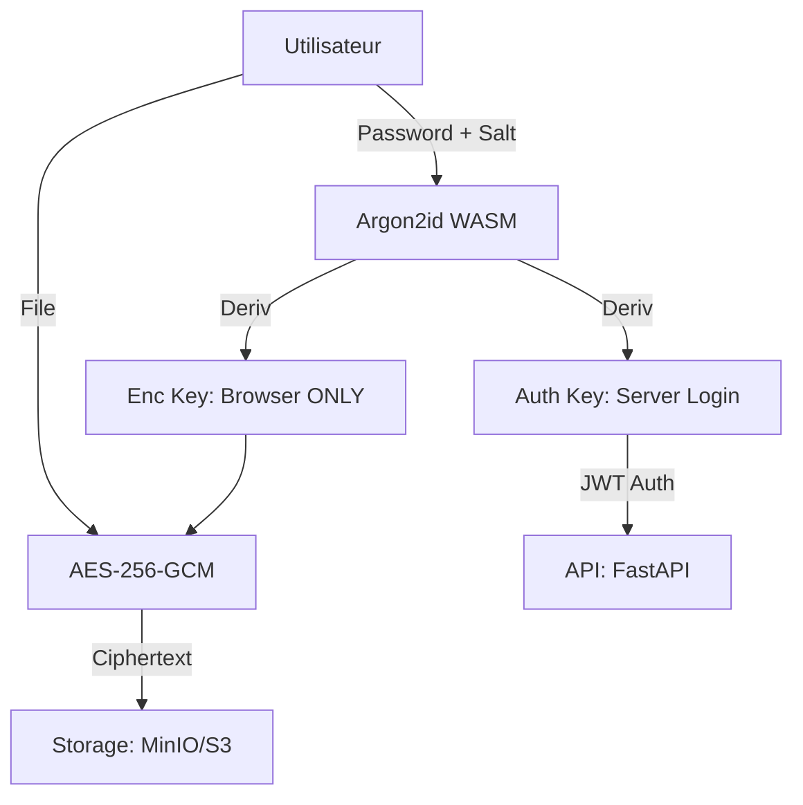

# 🔒 Veil — Zero-Knowledge Cloud Storage

**Localisation** : `c:\StackPro\ProjetMain\veil`

## 📝 Contexte & Objectifs

Veil est un "Coffre-fort Cloud" dont la philosophie repose sur l'aveuglement total du serveur. Contrairement à Dropbox ou Google Drive, Veil ne possède jamais les moyens de déchiffrer vos données. Tout le processus de sécurité (génération de clés, chiffrement des données) est exclusivement exécuté dans le navigateur du client.

## 🏗️ Architecture & Flux de Sécurité

### Détails Cryptographiques
- **KDF (Key Derivation Function)** : Utilisation d'Argon2id (WASM) pour transformer le mot de passe en clés de 32 octets. Paramètres : 64MB RAM, 3 itérations (équilibre sécurité/vitesse).
- **Chiffrement Authentifié** : Utilisation de l'API WebCrypto pour AES-256-GCM. Chaque fichier possède un IV (Vecteur d'Initialisation) de 12 octets aléatoire, garantissant l'unicité du ciphertext même pour deux fichiers identiques.
- **Zéro-Transmission** : La `encryptionKey` ne quitte jamais la mémoire vive (RAM) du navigateur.

## 🛠️ Stack Technique & DevOps

- **Backend** : Python 3.12, FastAPI, PostgreSQL (Métadonnées uniquement).
- **Frontend** : React 19, Zustand (Management d'état global).
- **Conteneurisation** : Multi-stage Docker builds.
- **CI/CD** : Pipeline Jenkins (Lint -> Test -> Build -> Trivy Scan -> Deploy).

## 📊 État d'Avancement

### Fait ✅
- **Crypto-Browser** : Implémentation complète d'Argon2 et AES-GCM dans le client.
- **Infrastructure** : Automatisation via Ansible pour le provisionnement local et distant.
- **Monitoring** : Benchmarks de performance validant des débits de >200MB/s pour le chiffrement.
- **Security** : Intégration de Trivy pour le scan des vulnérabilités des images Docker.

### TODO ⏳
- **Partage Sécurisé** : Implémenter le partage de fichiers via échange de clés asymétriques (RSA/Elliptic Curve).
- **App de Bureau** : Créer un client Desktop (Electron) pour une meilleure intégration système (glisser-déposer).
- **Multi-Node Storage** : Configurer la réplication MinIO sur plusieurs serveurs.

---
*Dernière mise à jour : 25 Avril 2026*
