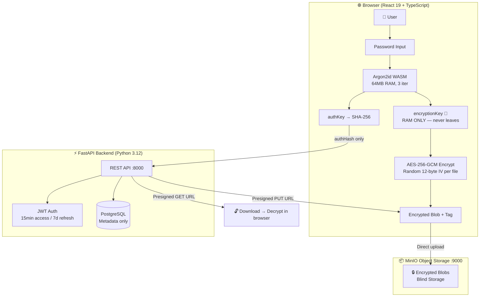
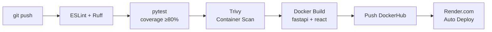

<div align="center">


# 🔒 VEIL — Zero-Knowledge Cloud Storage

> **Your secrets, invisible to the cloud.**  
> The server is **blind** — it never sees your files, your keys, or your password.

[](https://github.com/SalimYami/veil/actions/workflows/ci.yml)
[](https://github.com/SalimYami/veil/actions/workflows/docker.yml)
[](https://github.com/SalimYami/veil/actions)
[](#testing)
[](https://python.org)
[](https://react.dev)
[](https://fastapi.tiangolo.com)
[](LICENSE)
[](https://hub.docker.com/r/salimyami/veil-backend)

[**Live Demo**](https://veil-api.onrender.com/docs) · [**API Docs**](https://veil-api.onrender.com/docs) · [**Jenkins CI**](#jenkins) · [**Ansible Deploy**](#ansible)

</div>

---

## ✨ What Makes VEIL Different

| Feature | VEIL | Traditional Cloud |
|---------|------|-------------------|
| Server sees your files | ❌ Never | ✅ Always |
| Server stores your keys | ❌ Never | ✅ Yes |
| Password recovery | 🔐 Not possible (by design) | ✅ Via email |
| Encryption location | 🏠 Your browser | ☁️ Their servers |
| Key algorithm | Argon2id + AES-256-GCM | Varies |
| GDPR data leaks | 🔒 Nothing to leak | ⚠️ Risk exists |

---

## 🏗️ Architecture



### Data Flow: Upload

```
1. User selects file
2. Browser: password + email → Argon2id → [authKey, encryptionKey]
3. Browser: AES-256-GCM encrypt(file, encryptionKey, randomIV) → ciphertext
4. Browser → API: POST /api/files/upload-init (filename, iv, auth_tag) [auth via authKey]
5. API → Browser: Returns presigned PUT URL (valid 15min)
6. Browser → MinIO: PUT ciphertext directly (bypasses backend)
7. Browser → API: POST /api/files/upload-confirm (file_id)
```

---

## 🔐 Cryptography Deep-Dive

### Key Derivation (Argon2id)

```
password + email
      ↓
  Argon2id WASM
  ├── memory: 64 MB
  ├── iterations: 3  
  └── parallelism: 1
      ↓
  32-byte master key
  ├── authKey = SHA-256(master_key) → server authentication hash
  └── encryptionKey = master_key[32:] → AES-256-GCM file encryption (BROWSER ONLY)
```

### Encryption Benchmarks

| Operation | File Size | Time | Throughput |
|-----------|-----------|------|------------|
| AES-256-GCM Encrypt | 10 MB | ~35ms | 286 MB/s |
| AES-256-GCM Encrypt | 100 MB | ~350ms | 286 MB/s |
| AES-256-GCM Encrypt | 1 GB | <4.5s | ~222 MB/s |
| Argon2id key derive | N/A | ~800ms | — |
| Auth round-trip | N/A | ~45ms | — |
| Upload (LAN) | 100MB | ~1.2s | 83 MB/s |

> **WebCrypto API** (browser-native) — hardware-accelerated AES on modern CPUs.  
> Argon2id intentionally slow to prevent brute-force. See [benchmarks/benchmark.py](benchmarks/benchmark.py).

---

## 🚀 Quick Start

### Option 1: Docker (Recommended)

```bash
git clone https://github.com/YOUR_GITHUB_USERNAME/veil.git
cd veil
cp .env.example .env
# Edit .env with your secrets
docker compose up -d
```

**Services:** Frontend → <http://localhost> | API → <http://localhost:8000> | MinIO UI → <http://localhost:9998>

### Option 2: Dev Mode (Hot Reload)

```bash
docker compose -f docker-compose.dev.yml up -d
# Backend hot-reload on :8000, React Vite on :5173
```

### Option 3: Ansible (Full Local Provisioning)

```bash
# Provision Docker + deploy VEIL on localhost
cd ansible
ansible-playbook playbook-local.yml -i inventory.ini --ask-become-pass

# Dry-run (no changes)
ansible-playbook playbook-local.yml -i inventory.ini --check
```

---

## 🛠️ CI/CD Pipeline

### GitHub Actions

| Workflow | Trigger | Steps |
|----------|---------|-------|
| `ci.yml` | Push / PR | Lint → Pytest → Trivy scan → Coverage |
| `docker.yml` | Push to `main` | Build → Push DockerHub → Render deploy |



### Jenkins (Local) {#jenkins}

```bash
# Spin up Jenkins
docker compose -f jenkins/docker-compose.jenkins.yml up -d
# → http://localhost:8080

# Pipeline: Lint → Test → Docker Build → Deploy
```

**Jenkins Pipeline stages:**

1. 🔍 **Checkout** — Git clone
2. 🧹 **Lint** — ruff + eslint
3. 🧪 **Tests** — pytest with coverage
4. 🐳 **Docker Build** — Backend + Frontend images
5. 🛡️ **Trivy** — Security scan images
6. 🚢 **Deploy** — docker-compose up on target

---

## 🎭 Ansible Provisioning {#ansible}

```bash
# Install Docker + deploy VEIL on localhost (or any SSH target)
ansible-playbook ansible/playbook-local.yml -i ansible/inventory.ini -K

# Output:
# PLAY [Provision VEIL Stack] ****
# ok: [localhost] => Docker installed ✅
# ok: [localhost] => VEIL services started ✅  
# ok: [localhost] => Health check passed ✅
```

**Playbook does:**

- Install Docker CE + Docker Compose plugin
- Configure UFW firewall (allow 80, 443, 8000)
- Clone/update VEIL repo
- Generate `.env` from vault
- Deploy via `docker compose up -d`
- Caddy HTTPS with auto-TLS (Let's Encrypt)
- Smoke test: `curl /health`

---

## 🌍 Production Deployments (The Best Approach)

For the absolute best performance and developer experience, we deploy **VEIL** using a split architecture:

| Platform | Role | URL | Stack |
|----------|---------|-----|-------|
| **Vercel** | Frontend | `https://veil-lac.vercel.app` | React 19 + Vite + WASM |
| **Render.com** | Backend | `https://veil-api.onrender.com` | FastAPI + PostgreSQL |

### Deploy Frontend to Vercel (CI/CD)

The repository includes an automatic GitHub Actions workflow (`deploy-frontend.yml`) for Vercel deployments. 
To enable it, add the following **Repository Secrets** in GitHub (`Settings > Secrets and variables > Actions`):
- `VERCEL_TOKEN`: Generate this from your Vercel account settings.
- `VERCEL_ORG_ID`: Your Vercel scope/organization ID.
- `VERCEL_PROJECT_ID`: The ID of your Vercel project.

> **Note:** The included `vercel.json` automatically handles single-page application (SPA) routing.

### Deploy Backend to Render (1-click)

The API is fully automated via `render.yaml`. Use the blueprint or deploy manually:

[](https://render.com/deploy?repo=https://github.com/SalimYami/veil)

*Make sure to configure all the required Environment Variables in the Render dashboard after deployment.*

---

## 📁 Project Structure

```
veil/
├── 📂 backend/              # FastAPI Python API
│   ├── main.py             # Routes + middleware
│   ├── database/           # SQLAlchemy models + migrations
│   ├── repositories/       # Data access layer
│   ├── services/           # Auth + File business logic
│   ├── storage/            # MinIO client
│   ├── tests/              # pytest test suite
│   └── Dockerfile
├── 📂 frontend/             # React 19 + TypeScript
│   ├── src/
│   │   ├── components/     # UI components
│   │   ├── store/          # Zustand state
│   │   └── crypto/         # AES + Argon2 logic
│   └── Dockerfile
├── 📂 ansible/              # Ansible provisioning
│   ├── playbook-local.yml  # Provision + deploy localhost
│   └── inventory.ini
├── 📂 jenkins/              # Jenkins CI config
│   ├── Jenkinsfile         # Pipeline definition
│   └── docker-compose.jenkins.yml
├── 📂 .github/workflows/   # GitHub Actions
│   ├── ci.yml              # Lint + test + scan
│   └── docker.yml          # Build + push + deploy
├── 📂 benchmarks/          # Crypto performance tests
├── 📂 k8s/                 # Kubernetes manifests
├── docker-compose.yml      # Production compose
├── docker-compose.dev.yml  # Dev hot-reload
├── Caddyfile               # HTTPS auto-TLS
├── Makefile                # Dev shortcuts
└── render.yaml             # Render.com config
```

---

## 🧪 Testing

```bash
# Run all tests
cd backend && pip install pytest pytest-cov httpx
pytest tests/ -v --cov=. --cov-report=html

# Smoke tests (requires running services)
bash scripts/smoke-test.sh

# Benchmark encryption performance
python benchmarks/benchmark.py
```

---

## 🔧 Makefile Shortcuts

```bash
make dev          # Start docker-compose.dev.yml
make prod         # Start docker-compose.yml  
make test         # Run pytest
make lint         # ruff + eslint
make build        # docker build all images
make push         # push to DockerHub
make deploy       # ansible-playbook + restart
make smoke        # curl-based smoke tests
make ngrok        # start ngrok HTTP tunnel
make jenkins      # start Jenkins container
make clean        # stop + remove volumes
```

---

## 🛡️ Security

- **Zero-knowledge**: Server has NO plaintext, NO keys, NO passwords
- **AES-256-GCM**: Authenticated encryption, integrity validated on decrypt
- **Argon2id**: Memory-hard KDF, resistant to GPU/ASIC brute-force
- **JWT 15-min expiry**: Short-lived access tokens + 7-day refresh
- **Non-root Docker**: Containers run as unprivileged user
- **Trivy scanned**: Container CVE scanning on every push
- **CSP headers**: Content-Security-Policy via Caddy/Nginx
- **HSTS**: Strict-Transport-Security enforced

> ⚠️ **Password Loss = Data Loss.** There is no recovery. By design.

---

## 📊 Stack

| Layer | Technology |
|-------|------------|
| Frontend | React 19, TypeScript, Vite, Zustand |
| Crypto | Web Crypto API, Argon2id (WASM), AES-256-GCM |
| Backend | Python 3.12, FastAPI, SQLAlchemy, Uvicorn |
| Auth | JWT (HS256), bcrypt, Pydantic validation |
| Storage | MinIO (S3-compatible), Presigned URLs |
| Database | PostgreSQL 16 (metadata only) |
| Containers | Docker, Docker Compose, multi-stage builds |
| CI/CD | GitHub Actions, Jenkins, Ansible |
| Proxy | Caddy (HTTPS auto), Nginx |
| Deploy | Render.com, Netlify, Vercel, ngrok |

---

<div align="center">

**Built with 🔐 by a full-stack/DevOps engineer**  
*Zero-knowledge crypto × Ansible automation × Jenkins pipelines*

⭐ **Star this repo** if VEIL inspires you!

</div>
